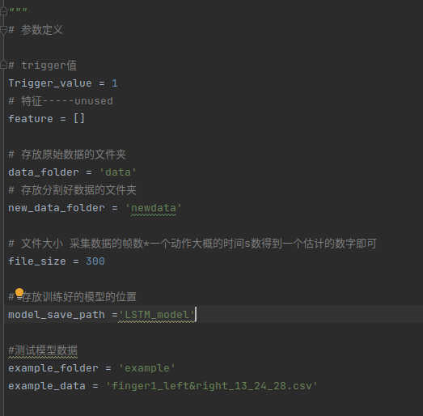

omg数据-LSTM项目
==
目前模型使用的数据为假数据（手动为文件的trigger值赋1）,后续使用放置正常采集的数据到对应文件夹再次训练即可。
### 如果遇到问题随时可以callme修改，真数据可能会有一些没有遇到过的问题
使用说明
==

可通过parameters文件进行一些变量的修改
==========

==========================使用说明===================================

文件夹自己按照需要起名建立即可
重点需要关注的是Trigger_value 如果分割使用的是2 改成2即可；

第二个重点是file_size 这个是对一个动作大致大小的一个估计，帧数*一个动作大概的时间即可得到。

##### （如果文件后期认为太大需要抽帧再联系或者直接修改一下处理大小的函数即可--在dataprocessing里）

具体使用步骤：

1、建立源数据文件夹并修改参数中的源数据文件夹的名字

2、进入源数据文件夹，按照需要建立以分类目标为名称的文件夹，并将采集的csv文件放到对应的分类的文件夹下；

3、建立一个存放处理好的数据的文件夹（eg:newdata)

4、检查一下parameters没有问题后，run dataprocessing.py

##### ->执行完毕后会看到newdata中生成了处理好的对应的文件夹的数据

5、run train.py 

##### ->执行完毕后会看到生成的模型的文件夹

6、（可选）在example文件夹下放入一个测试用的单动作csv文件，然后执行example.py查看测试结果

==========================文件说明===================================

omg_project:
 * data->源数据文件夹，采集的数据按照他的动作分类放到不同的文件夹->文件夹就是分类的标签，按照需要随意定义即可。（下面的是一些例子）
    * 文件夹的名字1-finger1_lefttoright(你也可以定义为f1-l-r等等，随意，但是最好不要中文)
        * 采集的数据.csv（可以放很多个文件，随意，命名也随意）
        * 采集的数据2.csv
        * 采集的数据3.csv
    * 文件夹2
    * 文件夹3
 * example ->保存示例数据的文件夹
 * LSTM_model->保存的模型文件夹的位置--比较大，暂时先删除，训练新的后会出现新的。
 * newdata->处理好的数据的文件夹->用于输入训练
 * venv-> 一个装好的虚拟环境的文件夹
 * dataloader.py->将从源数据-newdata-处理成可以输入模型的tensor数据
 * dataprocessing.py->将源数据处理成分割好并补全或者去掉冗余的数据
 * example.py->一个测试训练好的模型的例子文件，目前支持单个动作文件，如果需要多个文件的测试例子后续可以加进来。
 * label_mapping.csv->存放标签和模型直接预测的数值结果的对应。
 * parameters.py->修改需要改的参数的文件
 * Reaeme.md->本项目说明文件
 * requirements.txt->如果需要安装环境，这是依赖包版本文件，可用于一键安装。
 * train.py->训练文件
